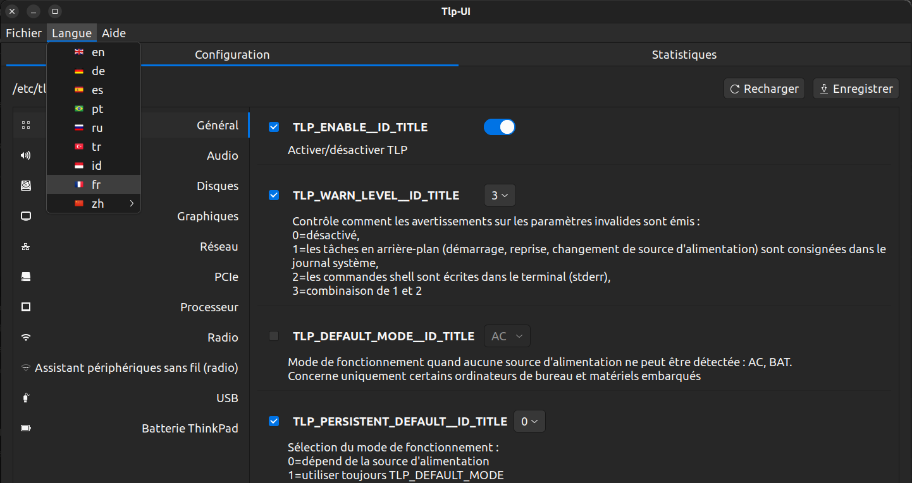

# TLPUI — Traduction française (fr_FR)



## À propos de cette traduction

Ce dépôt est un fork de [TLPUI](https://github.com/d4nj1/TLPUI), 
l'interface graphique pour TLP (gestionnaire d'énergie Linux).

Une Pull Request a été soumise au projet officiel pour intégrer 
cette traduction. En attendant, vous pouvez l'installer manuellement 
sur Ubuntu 22.04.

---

## Installation sur Ubuntu 22.04

### 1. Installer TLPUI
```bash
sudo add-apt-repository ppa:linuxuprising/apps
sudo apt update
sudo apt install tlpui
```

### 2. Appliquer la traduction française
```bash
sudo mkdir -p /usr/lib/python3/dist-packages/tlpui/lang/fr_FR/LC_MESSAGES

sudo wget -O /usr/lib/python3/dist-packages/tlpui/lang/fr_FR/LC_MESSAGES/mainui.mo \
https://github.com/FGinoux/TLPUI/raw/french-translation/tlpui/lang/fr_FR/LC_MESSAGES/mainui.mo

sudo wget -O /usr/lib/python3/dist-packages/tlpui/lang/fr_FR/LC_MESSAGES/statui.mo \
https://github.com/FGinoux/TLPUI/raw/french-translation/tlpui/lang/fr_FR/LC_MESSAGES/statui.mo

sudo wget -O /usr/lib/python3/dist-packages/tlpui/lang/fr_FR/LC_MESSAGES/uihelper.mo \
https://github.com/FGinoux/TLPUI/raw/french-translation/tlpui/lang/fr_FR/LC_MESSAGES/uihelper.mo

sudo wget -O /usr/lib/python3/dist-packages/tlpui/lang/fr_FR/LC_MESSAGES/configdescriptions.mo \
https://github.com/FGinoux/TLPUI/raw/french-translation/tlpui/lang/fr_FR/LC_MESSAGES/configdescriptions.mo

sudo wget -O /usr/lib/python3/dist-packages/tlpui/icons/flags/fr_FR.png \
https://github.com/FGinoux/TLPUI/raw/french-translation/tlpui/icons/flags/fr_FR.png
```

### 3. Activer le français
```bash
nano ~/.config/tlpui/tlpui.cfg
```
Changez `language = en_EN` en `language = fr_FR`

### 4. Lancer TLPUI
```bash
tlpui
```

---

## Histoire de cette traduction

Cette traduction a été réalisée en une journée avec l'aide de 
**Claude (Anthropic)**, une IA conversationnelle.

Je suis Frédéric, utilisateur GNU/Linux curieux et technophile mais 
je ne suis pas un développeur professionnel. 

Ma démarche est toujours la même :
**partir d'un besoin concret personnel**, développer une solution,
et une fois celle-ci suffisamment fonctionnelle, **la partager 
sous licence libre à la communauté**.

En parallèle de cette contribution, je développe **Dictee** — 
une application Python de dictée vocale en français, légère 
(fonctionne sur une machine avec 4 Go, compatible 
RGPD (vous pouvez travaillez hors ligne en conservant la 
maitrise de vos données), destinée aux personnes dyslexiques, 
dyspraxiques, aux étudiants et à tous ceux qui ont besoin 
de produire du texte rapidement sans clavier.

**Dictee** est aujourd'hui parfaitement fonctionnel et opérationnel 
pour produire du texte dans nimporte champ texte ou logiciel. 
Il est encore en développement actif pour :
- corriger quelques bugs et limitations liés aux ressources 
  externes sur lesquelles il s'appuie, avec des stratégies de 
  contournement en cours de finalisation
- compléter sa documentation
- créer un script d'installation

Ce projet m'a permis, sans le planifier, de développer des 
compétences en architecture logicielle et codage Python 
— la meilleure preuve que l'apprentissage par la pratique fonctionne.

### Mon message à ceux qui hésitent à se lancer

> *"L'IA est un outil dont vous devez apprendre à vous servir — 
> non pour penser et faire à votre place, mais pour étendre et 
> développer vos capacités. C'est un accélérateur de projet 
> et d'imagination."*
> — Frédéric, mars 2026

En une journée, assisté de Claude, j'ai pu :

- 🔧 Configurer un HP Spectre x360 2016 sous Ubuntu 22.04
- 📝 Traduire complètement TLPUI (793 lignes)
- 🐙 Créer mon premier compte GitHub
- 🔀 Soumettre ma première Pull Request
- 🇫🇷 Proposer la première traduction française de TLPUI après 10 ans !

Avec des notions de Python acquises progressivement, et surtout 
beaucoup de curiosité.

C'est une activité stimulante, créative et très ludique. 
Il n'y a rien de plus motivant que de voir ses propres idées 
prendre vie ligne après ligne ! Chaque petit succès donne envie 
d'aller plus loin. Alors lancez-vous — vous serez surpris de ce 
que vous êtes capable de créer ! 🚀

---

## Pour aller plus loin

Vous souhaitez vous lancer dans la contribution open source 
assistée par IA ?
- Conceptualisez et imaginez votre projet
- Créez un compte sur [claude.ai](https://claude.ai)
- Décrivez votre problème, posez vos questions
- Apprenez en faisant — chaque erreur est une leçon !

> 💡 Bientôt disponible : **Dictée** — application de dictée vocale 
> en français, compatible RGPD, pour les personnes dyslexiques, 
> dyspraxiques et tous ceux qui souhaitent produire du texte 
> sans clavier.

---

## Liens

- 🔗 [Projet officiel TLPUI](https://github.com/d4nj1/TLPUI)
- 🔗 [Pull Request de la traduction](https://github.com/d4nj1/TLPUI/pull/#179)
- 💼 [Mon profil LinkedIn](https://linkedin.com/in/fr%C3%A9d%C3%A9ric-ginoux-749086b1)
